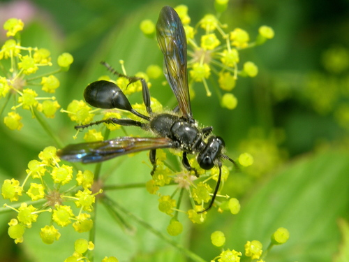

# An iNaturalist-pl@ntNet-workflow to identify plant-pollinator interactions – a case study of *Isodontia mexicana*

During the Alien-CSI Hackathon in Romania, which focused on ecological interactions of invasive species, the Coding Club idea of deriving information about plant-pollinator interactions from iNaturalist images was further developed. *Isodontia mexicana*, native to North America and introduced to Europe, was chosen as an example species. The objective was to see if it is possible to learn more about which plant species, genera, and families are visited by *I. mexicana* from images of the insects on plants.

The general approach of this idea is, to retrieve research grade quality image URLs from iNaturalist and feed these URLs as a bunch into the plant identification app [Pl@ntNet](https://plantnet.org/en/). Pl@ntNet returns for each imageURL a list of candidate plants with a corresponding score between 0.001 (lowest) and 1 (pretty sure about that plant). In a test study, this workflow was not only tested, but also the performance of Pl@ntNet assessed by comparing the results to expert botanists identification of the plants.Thereby, score thresholds could be defined above which the Pl@ntNet app can be used accurately and reliably for the proposed study.

The repository contains the R code to reproduce the study for biohackrxiv:
1. Extract image URLs of target species observations from iNaturalist.
2. Get candidate lists of potential plant species per iNaturalist image from plantNet.
3. Merge datasets and descriptive statistics.
4. Adapted get_inat_obs() command.

